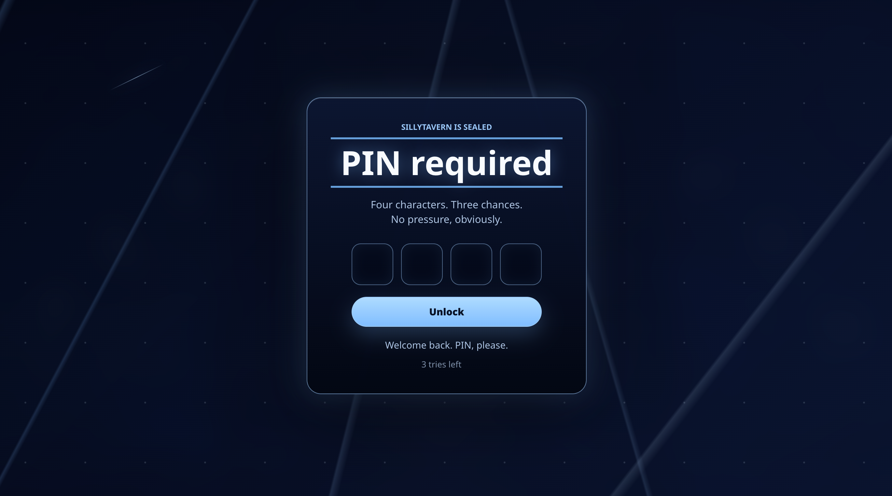

# Blue PIN Lock

A SillyTavern UI extension that blocks the screen on startup and whenever the tab loses focus, then unlocks with your chosen 4-character PIN.

After three wrong attempts, it locks for 5 minutes. The lockout timestamp is stored in `localStorage`, so refreshing the tab does not skip the timer.

## Install

Place the contents of the repository in either:

- `SillyTavern/public/scripts/extensions/third-party/blue-pin-lock`
- `SillyTavern/data/<your-user-handle>/extensions/blue-pin-lock`

Or, use the built-in SillyTavern Extensions Manager at `Extensions > Install Extension` using this link:

`https://github.com/jesseblueberry/sillytavern_password_checker/`

Then restart or reload SillyTavern and enable the extension if needed.

## PIN

On first run, the extension asks you to choose and confirm a 4-character PIN. It is stored in browser `localStorage`.

To reset it, delete the `blue-pin-lock:pin` value from localStorage and reload SillyTavern.

This is a client-side privacy lock, not serious cryptographic security. Anyone with direct browser/devtools access can read or change it. This is not meant to be a serious security tool, simply a lock.
